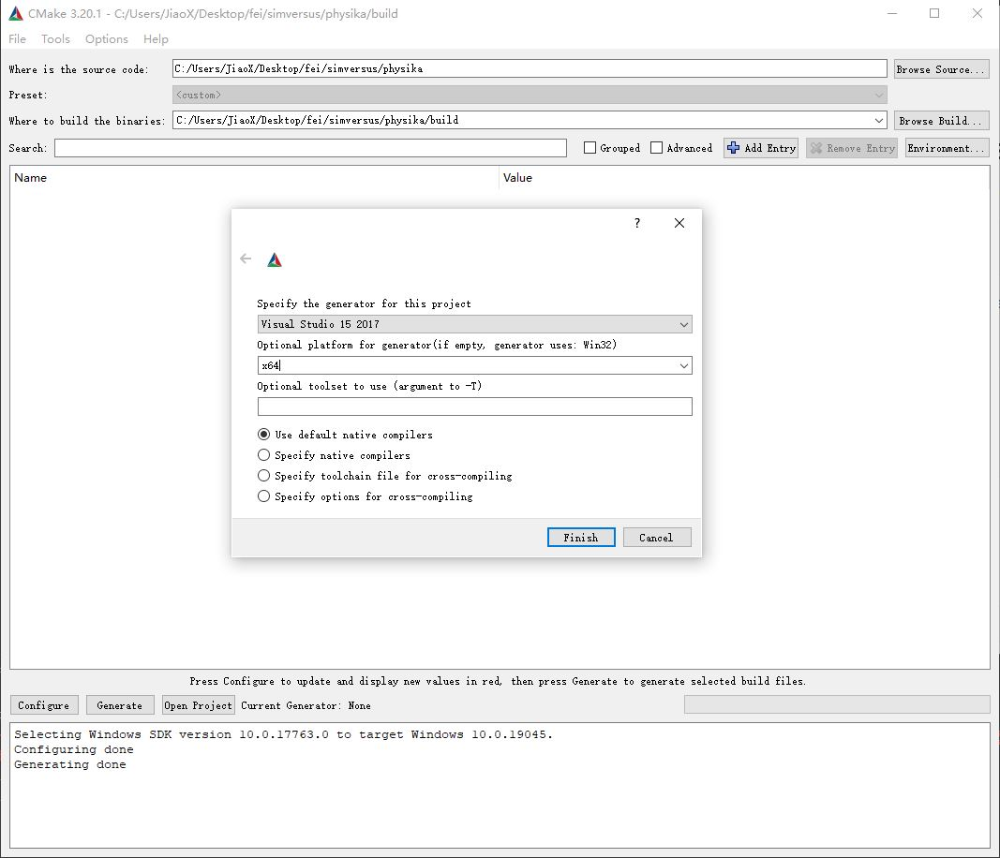

## Platforms:
* Linux: Full support (Ubuntu)
* MacOS: Should work as well, yet no warranty
* Windows: Full support (MSVC)
* Docker: Full support (Ubuntu mirrors)
## How to build?
### Native build (Linux && MacOS):
1. Initialize submodules (for newly cloned code)
```
git submodule init
git submodule update
```
2. Build with CMake (Refer to top-level CMakeLists.txt for more build options)
* Linux && MacOS:
```
mkdir -p build
cd build
cmake -DCMAKE_INSTALL_PREFIX=../install -DINSTALL_GTEST=OFF ..
make
make install
```
* Windows (MSVC):
Use CMake GUI and configure as below to generate MSVC solution file and build solution within MSVC.



### Docker build
```
sudo docker build -f ./docker/Dockerfile -t physika .
```
An ubuntu 20.04 mirror of Physika is built, where the artifacts are located in path /physika_release.

### Issues && Solutions
1. **Issue:** Github timeout during submodule upate and cmake configure.

    **Solution:** Setup a proxy that could pass through GFW and retry (again and again...).

    **Resolved:** We setup Gitee mirrors for these repositories.
2. **Issue:** NVCC cannot comiple entt code ([Github issue](https://github.com/skypjack/entt/issues/1082)).

    **Solution:**  Place CUDA code and CPU code in separate files to enforce that framework/world.hpp and framework/object.hpp are not included in .cu files. Refer to framework_sample.